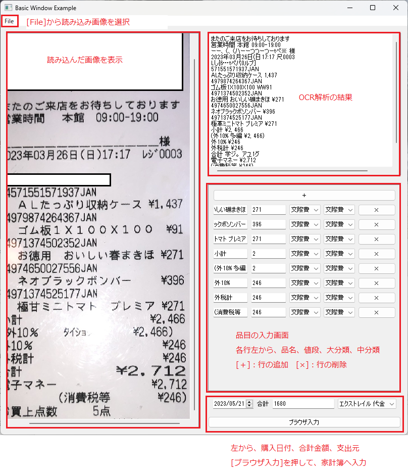

# receipt-inputter
[はじめに](#はじめに) 
[作成した理由](#作成した理由) 
[実装した機能](#実装した機能) 
[使用手順](#使用手順) 
[今後の修正点](#今後の修正点) 

### はじめに
紙のレシートを手で入力することはとても煩雑で手間がかかります。 
そのため、紙のレシートを家計簿に自動で入力するために作りました。 
また、このソフトの作成を通じて、ソフトウェアの作成の勉強ができればと考えています。 
2023/5/20 今後、アルファ版を作成するために要件定義等を行っていく予定です。 

### 作成した理由
非ITエンジニアです。プログラムは大学時代学びましたが、地方の中規模病院で事務職をしています。
事務職は斜陽ということもあり、転職を考えています。多少経験があるとはいえ何の実績もないので、１つアプリを開発しようと思い作成しました。 

### 実装した機能
- スマホで撮影したレシートをOCRで文章化 
- 値段部分のみを撮影した画像から品名、値段を抜き取る 
- OCRの結果から品名、値段を取得する 
- GUIを使用して品目、値段等を手動で変更する 
- 自動でMoney Forword Meのサイトにログインする 
- 自動で品目、値段等を入力、確定する 

### 使用手順
1. スマホ等でレシートの画像を撮影し、このコードを実行する端末の任意の場所に保存する。
1. check_receipt_GUIを起動する
1. [File]-[開く]から1で撮影した画像を選択する
1. 画面右下の内容を確認し、修正を行う 
    修正内容は左から順に、品名、値段、大分類、中分類、レシートごとに購入日付 
    「＋」で行の追加 
    「×」で行の削除
1. [ブラウザ入力]を押す 
  [ブラウザ入力]を押すとブラウザが起動し、Money Forword Meへ自動で入力を行います。
  
   
  
### 今後の修正点
- リファクタリング
    - コードをきれいにする（特にGUI周り）
    - 不正操作を予防するコードにする
    - データクラスの作成
- GUI
    - 画面拡大時に表示を自動調整する機能
    - 各項目の大きさを調整
    - 項目の位置を調整
- ブラウザ操作
    - APIを使用できるか調査
    - ログインを安定して行えるように改良
    - 不正な操作が起きた場合の対応を追加
- 連続でレシートを編集＆入力する機能
    - 分類ごとに集計、入力前にプレビュー
    - 読み込んだ画像を選択できる機能
    - 入力する画像を選択できる機能
- OCR精度の向上
    - 半角カナ、太字がうまく読み取れるようにする
    - ロゴマークから店舗の名前を読み取る
    - 読み取り画像の処理（トリミング、輝度調整）
- 購入品目の読み取り制度を高くする
    - 入力画像の傾き、影を補正する。あるいは物理的な方法で対応する。
    - 小計、合計、値引き、内税表記を入力行に入れないようにする
    - 大分類、中分類を推測し、表示する
- 実行の結果をまとめる
    - ログファイルを作成
    - 画像も保存する

### 今後やること
- 調査
    - 今後やるべきことを列挙する
    - どんな技術・知識・APIが必要か調査する
- 要求定義
    - どんなシステムにするか
    - すべきことを決める
    - やらないことを決める
- 要件定義
    - 機能要件
    - 非機能要件
- 設計
    - 基本設計
        - 業務フロー図
        - ソフトウェア構成図
        - 機能一覧
        - ソフトウェア構成図
        - 画面レイアウト
    - 詳細設計
        - 機能ごとの処理フロー
        - 画面の項目説明
        - 画面遷移図
        - 帳票の項目説明
        - クラス図
        - テストケース
- 実装
    - コーディング
    - 統合
    - テスト（内部デプロイは省略）
- ふりかえり
